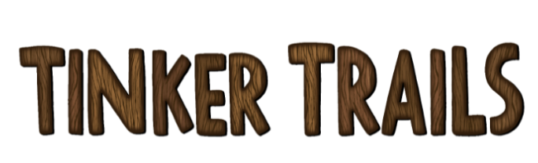

# Educational-Physics-Game

Tinker Trails is a 2d level-based puzzle game. Players are tasked with building cars to traverse different terrains, and each level requires players to utilize a variety of physics concepts in order to get their car to the end.
As players progress through the game, and levels get more specific and harder to complete, and the players will go from an intuitive understanding of physics to a more fundamental understanding of physics concepts like forces, gravity, and motion.

Tinker Trials: An Exciting New Way to Teach Physics to Children
How Games Can Help Empower STEM Learning

Middletown, Connecticut (May 7, 2024) - We are designing a new game to help teach kids physics concepts in an exciting and fun way to help remedy declining test scores in STEM. Stranded on an island, you must construct vehicles using a variety of parts to solve puzzles and complete levels that will both intuitively and explicitly teach an understanding of physics. We utilize an iterative problem-solving approach where students are given space to make mistakes and rapidly iterate on them, providing explanations when they win.

The National Center for Education Statistics found that U.S. 4th graders ranked 15th out of 64 participating countries in math scores, and, in an older study, the Pew Research Center found that U.S. Students ranked 12th out of 37 OECD countries in science. We aim to combat this decline by providing a fun and engaging learning tool for teachers and students so that the groups most in need of help can receive it. Our focus is on 2nd through 5th graders, but primarily 4th and 5th. 

We adhere to the NGSS (Next Generation Science Standards), supplementing and focusing on the NGSS PS2.A: Forces and Motion and NGSS ETS1.A: Defining and Delimiting Engineering Problems standards.

To help us in our mission, watch our game trailer or play our build. With your help, we can help offset these negative trends in STEM learning.

